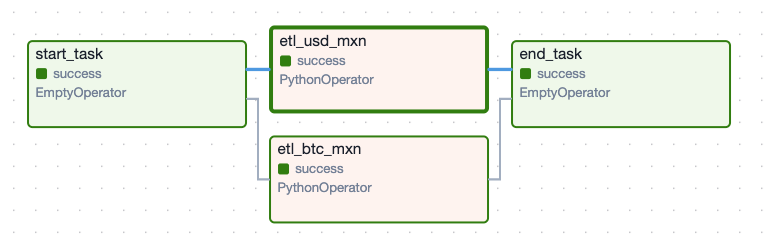
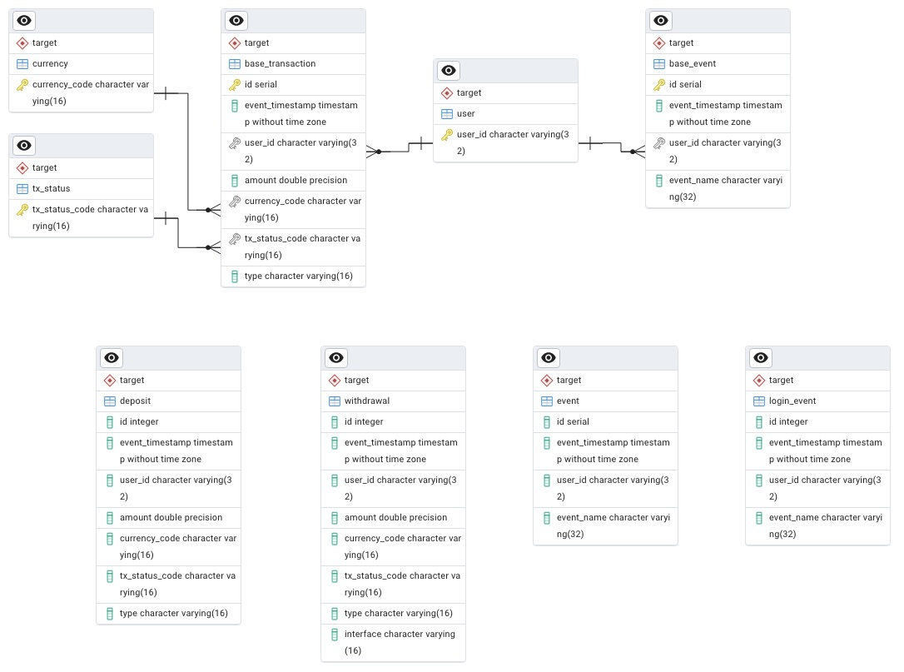
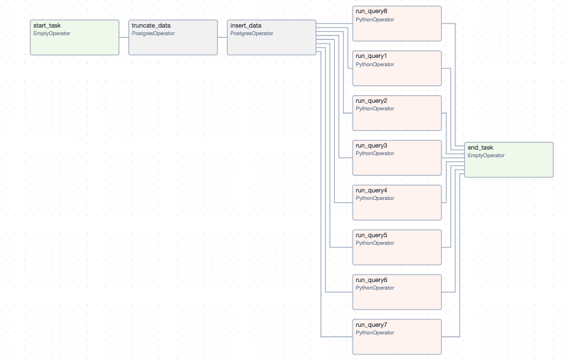

# Bitso Data Engineering Challenges

## Challenge 1: Real-time Data Streaming

### Objective
The goal of this challenge is to monitor the bid-ask spread from the Bitso exchange's order books (MXN_BTC and USD_MXN). We need to perform custom analysis on the bid-ask spread and create alerts whenever the spread exceeds predefined thresholds.

### Implementation Details
To achieve this, we utilized functions defined in `dags/spread_functions.py`:
- **Fetch Data**: Fetches bid-ask spread data from the Bitso API.
- **Transform Data**: Computes the spread percentage and prepares it for storage.
- **Prepare Partitioned Directory**: Organizes data into a directory structure suitable for storage in S3.

### Testing
Unit tests for these functions are available in `tests/bid_ask_dag.py` and can be executed using `pytest`.

### Orchestration Logic
Every 10 minutes, the `etl_ticker` DAG is triggered. During each run:
- Data is fetched and transformed from the `get_ticker` API endpoint.
- Transformed data is stored in the `bucket/get_ticker` directory.



### Running the Orchestration
To run the orchestration, execute the following commands:

```bash
docker-compose up airflow-init # prepare services used for airflow 
docker-compose -f compose.yml up -d 

docker exec -it bitso-webserver-1 bash  # get inside the container
pytest test/test_spread_functions.py  # unit test used for this DAG
```

Access Airflow in your web browser at `localhost:8080`. Navigate to the `etl_ticker` DAG. Use default credentials for login.

## Challenge 2: Daily batch Streaming

### Objective
The goal of this challenge is to optimize and model data from four snapshot tables representing deposits, withdrawals, events, and users in a database. The objective is to facilitate data insights and analytics. Key tasks include:

- **Active Users**: Determine how many users were active on a given day based on deposits or withdrawals.
- **No Deposit Users**: Identify users who have not made any deposits.
- **High Volume Depositors**: Identify users who have historically made more than 5 deposits on a given day.
- **User Login Analysis**: Track the last login time for users and calculate login frequency between two dates.
- **Currency Insights**: Count unique currencies deposited and withdrawn on a given day.
- **Daily Currency Deposits**: Calculate the total amount deposited for a specific currency on a given day.

### Data Modeling
To achieve these goals, we have refined the database schema as follows:
- Initial table definitions are captured in `sql/db.sql`.
- Optimized data model is outlined in `sql/new_model.sql`.
- Introduced a `target` schema to store data extracted from the initial snapshot files.
- Introduced a `target.login_event` table to save only login events.
- Type from `base_transaction` could be removed but it is useful to distiguish their subclasses.

The new model includes:
- **Categorical Tables**: `target.user`, `target.currency`, and `target.tx_status` for storing user-related data, currency information, and transaction statuses (We could have used enumeration type too).
- **Base Tables**: Utilization of inheritance (`base_*` tables) to streamline attributes common across multiple entities.
- **Primary and Foreign Keys**: Ensuring data integrity and facilitating efficient querying.



Note: in the diagram, deposit and withdrawal are disjoint subclasses of base_transaction and their attributes are non-repetitive, similarly with base_event. This is not represented by pgAdmin generation tool.


### Data Migration
Data migration from the original snapshot tables to the optimized schema (`target`) is managed through `sql/migration.sql`. This script ensures seamless transfer while adhering to the new data model's structure.

### Querying Insights
To address the specified questions, SQL queries have been formulated and stored in `sql/queries.sql`. These queries are designed to extract actionable insights, enabling stakeholders to derive meaningful analytics from the data.

### Orchestration
The dag will read from source files, transform and load the rows into the new model using PostgresOperator. Once this is set, we will generate the result set with the requested queries and save into a separed files into `bucket/batch_output`.



### Considerations
While the new data model enhances data integrity and query efficiency, potential downsides include increased computation for joins due to normalization and inheritance. However, these trade-offs are balanced against improved storage efficiency and reduced redundancy.

For high-performance scenarios, denormalization and reducing constraints may be considered, depending on specific business needs, we will prefer NO SQL, database or data warehouse solution. This approach can optimize query speed at the expense of data redundancy.

### Running the Orchestration
Similar as before, once the containers are running, the orchestration expects to have a DB called `batch` with the new ER model and the source data. We expect also to have .csv files stored in volume `bucket/samples` as we will be using postgres `COPY` command. We also need to add postgres connection. There is an `entrypoint.sh` that prepares the enviroment for our DAG: 

```bash
docker-compose up airflow-init
docker-compose -f compose.yml up -d


docker exec -it bitso-webserver-1 bash  # get inside the container
sh entrypoint.sh  # prepare enviroment for ingestion

# optional, you can trigger the dag via CLI
airflow dags trigger daily_batch
```

The generated files will be in `bucket/batch_output`.